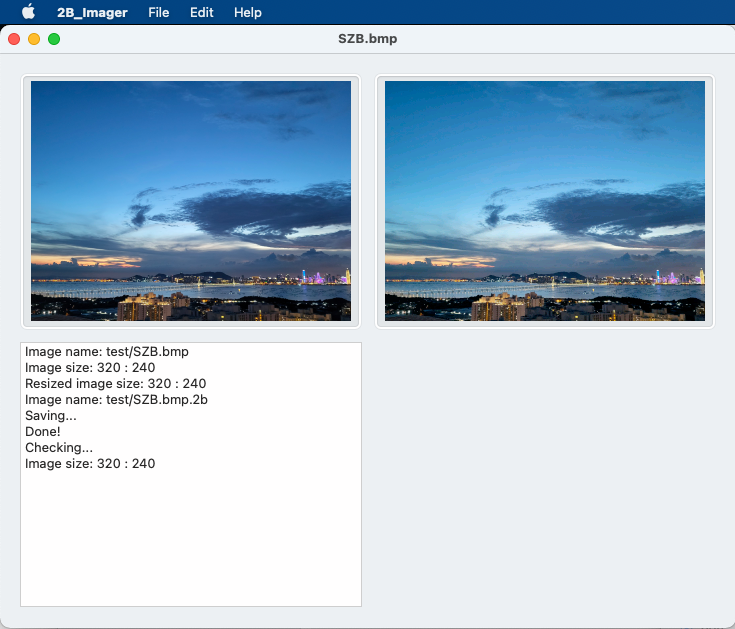

# BastWAN_Featherwing_2B_Demo

A two-part project to make displaying images easier on low-powered MCUs + ILI9341. This demo uses a BastWAN (see [here](https://electroniccats.com/store/bastwan/) and [here](https://store.rakwireless.com/products/rak3244-bastwan-breakout-board)), on a [Keyboard FeatherWing](https://www.solder.party/docs/keyboard-featherwing/).

## Background

I have two applications, called BastMobile, based on this setup, to do tests with LoRa and LoRaWAN. Both apps work pretty well, if I may say so :-), but they don't look THAT great, and could use a revamp – and possibly a merge. I think there's still enough Flash and RAM in the BastWAN to make it just the one app.

So my first goal was to re-design the UI, making it look a little less utilitarian than this:


I am thinking a nice photo as background, some icons, use of the joystick and buttons, maybe the touch screen too (but on v1 of the Keyboard FeatherWing, it is... not very good). So. Nice photo.

I started with the [BMP format](https://en.wikipedia.org/wiki/BMP_file_format), which is easy enough to decode (if you control the conversion anyway). But it was still too cumbersome for small MCUs, and if I was to prepare the images on a computer, I might as well make ALL the preparations on the computer, and produce a file that's as easy to handle as possible. Considering that one of the functions in most ILI9341 libraries is to dump 16-bit colors (565 format) after setting a rectangle, that's what I went for. So the format looks like this:

| "2B" | width | height |
|---|---|---|
| 2 bytes | 2 bytes | 2 bytes |

After which the 565 colors follow. My system is little endian, whereas most TFTs are big-endian, so I *should* reverse the bytes in the stream, but that isn't much of a strain, even for the BastWAN RAK4260 MCU (Cortex M0+):

```c
      tft.spiWrite(mb[ix + 1]);
      tft.spiWrite(mb[ix]);
      ix += 2;
```

So all I needed was a GUI application that would accept images, resize them if needed to 320x240 at most, and save them as a `.2B` file.



As you can see, the conversion from the original image, resized, on the left, to the 565 image on the right is pretty good. It takes less than a second, so you can basically drop all your files one by one and pick up the `.2B` files when done, and copy them to an SD card.

## How does it work?

Let's have a look at the example code. It will explain everything:

```c
void loop() {
  displayImage("/SZB.2B", 0, 0, tft);
  delay(2000);
  displayImage("/BEACH.2B", 0, 0, tft);
  uint16_t buff[46 * 46]; // Cheating here, because I know CALM.2B is 46 x 46
  if (!preloadImage("/CALM.2B", buff)) {
    SerialUSB.println("Could not preload CALM.2B!");
    while (1);
  }
  uint16_t calmWidth, calmHeight;
  calmWidth = pWidth;
  calmHeight = pHeight;
  displayImage(buff, calmWidth, calmHeight, 274, 194, tft);
  delay(2000);
  displayImage("/GREECE1.2B", 0, 0, tft);
  displayImage(buff, calmWidth, calmHeight, ALIGN_RIGHT, ALIGN_BOTTOM, tft);
  delay(2000);
```

The `displayImage()` function comes in two versions: the "original" function that reads a `.2B` file from the SD card, and another that I added later, after I realized it would be nice to have a similar function that reused a buffer loaded from the SD card file, and displayed that without having to reopen the SD card file. Which is what `preloadImage()` does: it loads the image in memory, instead of displaying it. The second version, `void displayImage(uint16_t *colors, uint16_t zWidth, uint16_t zHeight, uint16_t XX, uint16_t YY, Adafruit_ILI9341 tft)` draws it where you want. Never mind that there's already a similar function in the ILI9341 library... ;-) Who cares, I wanted to roll my own!

There's a `readRect()` function, but it seems to be buggy, and I'll get back to that later.


### A quick demo

